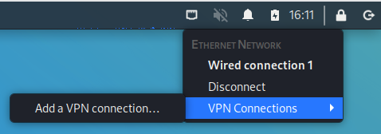
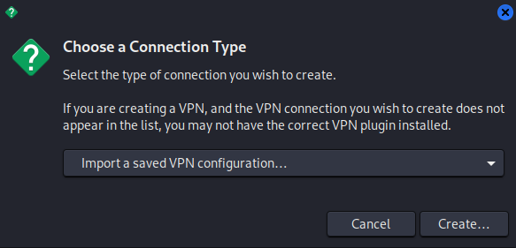
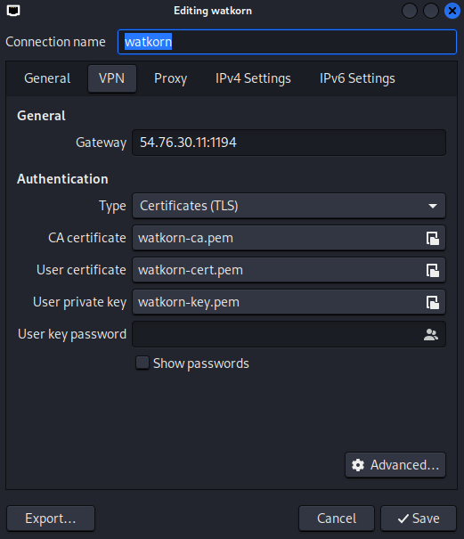

# install-first-kali 2022.8  
-usr/pass : kali/kali  
sudo apt update  
sudo apt upgrade  

#chrome install  
cd Downloads/  
wget https://dl.google.com/linux/direct/google-chrome-stable_current_amd64.deb  
sudo apt install gdebi-core  
sudo gdebi google-chrome-stable_current_amd64.deb  
#set chrome to default  
sudo update-alternatives --config x-www-browser  

#vol3 #python3  
cd Desktop/  
git clone https://github.com/volatilityfoundation/volatility3.git  
cd volatility3  
pip3 install -r requirements-minimal.txt  
python3 setup.py build  
sudo python3 setup.py install  
sudo apt-get install libsnappy-dev  
pip3 install -r requirements.txt  
python vol.py -h  

#vol #pythno2  
sudo apt install -y build-essential git libdistorm3-dev yara libraw1394-11 libcapstone-dev capstone-tool tzdata  
cd Desktop/  
git clone https://github.com/volatilityfoundation/volatility.git  
sudo apt install -y python2 python2.7-dev libpython2-dev  
curl https://bootstrap.pypa.io/pip/2.7/get-pip.py --output get-pip.py  
sudo python2 get-pip.py  
sudo python2 -m pip install -U setuptools wheel  
python2 -m pip install -U distorm3 yara pycrypto pillow openpyxl ujson pytz ipython capstone  
sudo python2 -m pip install yara  
sudo ln -s /usr/local/lib/python2.7/dist-packages/usr/lib/libyara.so /usr/lib/libyara.so  
python2 -m pip install -U git+https://github.com/volatilityfoundation/volatility.git  

#set openvpn of tryhackme  
-find vpn button  

  

-choose import  

  

-ok  

  

#set auto login  
sudo updatedb  
cat /etc/X11/default-display-manager  
locate lightdm.conf  
sudo nano -l /etc/lightdm/lightdm.conf  
-uncomment line 126 (delete #) and make it look like | autologin-user=kali  
-Ctrl + O to save  
-Ctrl + X to quit  
-reboot  

#pdfinfo  
sudo apt install poppler-utils  

#image slicer  
pip install image-slicer  

#Pillow  
sudo pip install Pillow

